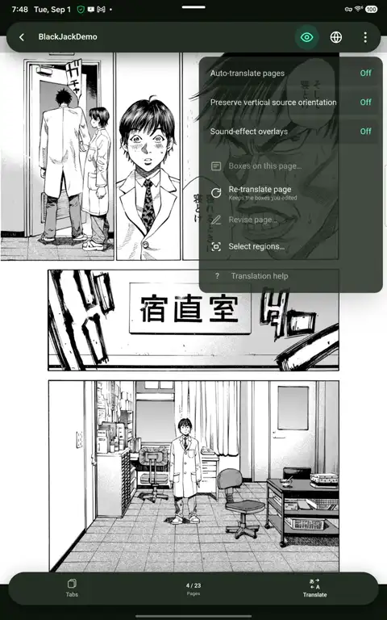

# Fumeto Reader Plus

A manga and comic reader for Android — and, in beta, for Linux desktops —
that **translates the page you're looking at — entirely on your device if
you want**. Speech bubbles are
detected, read, translated, and re-lettered inside the original balloons;
one tap flips back to the untranslated page.

<p align="center"></p>

Free, no ads, no accounts, no analytics. GPL-3.0.

[**Get it on Google Play**](https://play.google.com/store/apps/details?id=com.fumeto.reader) ·
[GitHub releases](https://github.com/fumetodev/FumetoReaderPlus/releases) (APK, works with [Obtainium](https://github.com/ImranR98/Obtainium)) ·
[Linux AppImage (beta)](#linux-desktop-beta)

## Install with Obtainium

[Obtainium](https://github.com/ImranR98/Obtainium) can track this repository and keep the app
updated: add `https://github.com/fumetodev/FumetoReaderPlus` as an app and set its APK filter to
`arm64\.apk$`.

Builds from Google Play and from GitHub are signed with different keys, so moving from one to the
other means uninstalling first (local library data is lost in the process).

## Linux desktop (beta)

Every release also carries `fumeto-<version>-x86_64.AppImage` and a `.sha256` file next to it.

```bash
sha256sum -c fumeto-<version>-x86_64.AppImage.sha256
chmod +x fumeto-<version>-x86_64.AppImage
./fumeto-<version>-x86_64.AppImage
```

It is the same app as on Android — local import, your own Komga/Kavita/YACReader server, EPUB,
export, and both translation paths, including fully on-device translation.

- **Requirements.** An x86-64 machine with glibc 2.35 or newer (Ubuntu 22.04, Debian 12,
  Fedora 36 or later) and a GTK 3 desktop. On-device translation needs a CPU with AVX2, FMA and
  F16C (Intel from 2013, AMD Zen and later); on an older CPU the app still runs and tells you
  why on-device translation is unavailable, and provider-based translation keeps working.
- **FUSE.** Like every AppImage it mounts itself with FUSE 2. If it refuses to start, install
  your distribution's `libfuse2` (Debian/Ubuntu) or `fuse-libs` (Fedora), or run it with
  `--appimage-extract-and-run`.
- **First use.** The text-detection, recognition and layout models (about 126 MB) download from
  Hugging Face the first time you translate, and the on-device translation model when you pick
  one — exactly as on Android. Everything the app stores lives in
  `~/.local/share/com.fumeto.reader/`; deleting that folder and the AppImage is a complete
  uninstall.
- **Keyboard and mouse.** Arrow keys, Space and Page Up/Down turn pages, Home/End jump to the
  first and last page, `f` or F11 toggles fullscreen, Escape leaves the reader. Scroll to pan,
  Ctrl+scroll to zoom. Import through the file dialog or by dropping files or a folder onto the
  window.
- **Display.** The app runs as an X11 client (through XWayland on Wayland desktops). On machines
  with the NVIDIA driver it disables WebKitGTK's DMA-BUF renderer at startup, which works around
  a known blank-window bug; set `FUMETO_NVIDIA_WORKAROUND=off` to skip that, or set
  `WEBKIT_DISABLE_DMABUF_RENDERER=1` yourself on another GPU if the window stays blank
  (`WEBKIT_DISABLE_COMPOSITING_MODE=1` is the last resort).
- **Video.** Video files play through GStreamer. If a video stays black, install your
  distribution's `gstreamer1.0-plugins-good`, `gstreamer1.0-plugins-bad` and
  `gstreamer1.0-libav` packages.
- **Updates.** Once a day the app asks GitHub whether a newer release exists and shows a notice
  with a download link; the check can be switched off in Settings.
- **Reporting a problem.** Start the app from a terminal with `FUMETO_LOG=info` in front of the
  command and attach the output together with the About line from Settings.

The Linux build is a **beta**: it is built and smoke-tested in CI and verified on Ubuntu 22.04 and
on a rolling distribution with an NVIDIA GPU, but not yet across the range of desktops and drivers
Android devices get. Untested so far: Intel GPUs, KDE and XFCE, drag-and-drop from sandboxed
(Flatpak) file managers, SELinux-enforcing systems and NixOS. Bug reports are welcome.

## What it does

- **Read** CBZ/CBR/PDF archives and EPUB books, imported locally or served from
  your own **Komga / Kavita / YACReaderLibraryServer** — credentials stay on
  the device and only ever go to your server.
- **Translate** two ways, both free and unmetered:
  - **On-device**: PP-OCR text detection/recognition + a Hy-MT2 1.8B model
    fine-tuned specifically for manga (ONNX Runtime + llama.cpp, no network,
    no key). Around 6–16 s per page on a current flagship.
  - **Bring your own key**: OpenRouter or any OpenAI-compatible endpoint,
    including LM Studio / Ollama on your LAN.
- **Letter it properly**: translations are laid out inside the detected
  balloons by a deterministic layout engine — conjoined balloons are split at
  their necks, shared balloons are carved by usable area, unbounded vertical
  runs get translucent feathered erasures, English gets real hyphenation.
  Every box can be dragged or edited, and edits persist.
- Whole-volume batch translation (resumable, with an optional 2-pass
  consistency review), revision passes, translated-CBZ export, guided-region
  translation, webtoon long-strip mode, right-to-left paging, tabs, and a UI
  drafted into 8 languages.

## Building

### Android

Prerequisites: **JDK 21** (exactly — newer JDKs are not supported by this
Gradle), Android SDK + **NDK 29.0.13846066** (`ANDROID_HOME`, `NDK_HOME`
exported), Rust stable, and Node 22/24/26 (`engine-strict` rejects 20/23/25).

```bash
npm ci
npm run dev                              # frontend only, in a browser (WASM fallbacks)
npm run tauri:android-build -- --debug   # debug APK
npm run tauri:android-build              # release (needs a signing keystore + key.properties, both gitignored)
```

The first Android build compiles the vendored llama.cpp for each ABI
(~20 minutes). The rtmdet layout model (~43 MB) is fetched from Hugging Face
during the Gradle build.

### Linux

Prerequisites on Ubuntu 22.04 (the oldest supported base, and what CI builds on):
`build-essential cmake pkg-config libwebkit2gtk-4.1-dev libgtk-3-dev librsvg2-dev patchelf
xdg-utils file`, plus Rust stable and Node 22/24/26.

```bash
npm ci
npm run tauri:linux-build   # AppImage under src-tauri/target/release/bundle/appimage/
npm run release:linux       # preflight, build, audit, then collect into dist/linux/ with a .sha256
```

The first build compiles the vendored llama.cpp (~10 minutes) for a fixed AVX2/FMA/F16C
baseline, never for the build machine's own CPU. On a distribution newer than the floor the
bundler's own `strip` cannot read the system libraries, so the ladder sets `NO_STRIP=true` there
(`npm run tauri:linux-build` needs it in the environment by hand). An AppImage built locally embeds the host's
WebKitGTK and needs the host's glibc version or newer, so it is for testing; the AppImages on the
releases page come from CI's Ubuntu 22.04 container.

## Tests

The test and evaluation suites (unit, UI, device journeys, and the
overlay/OCR evaluation harnesses) are maintained privately, together with the
licensed evaluation corpora they run against. `npm run check` covers the
static gates that ship here.

## Project notes

- SvelteKit 5 SPA running inside a Tauri v2 Android WebView; Kotlin/C++
  accelerators (ONNX Runtime, llama.cpp) behind injected JS bridges; all
  product state lives in the WebView (Dexie/IndexedDB). Linux is a beta desktop
  target (AppImage) that shares the whole frontend and runs llama.cpp through a
  Rust bridge; macOS and Windows are not built.
- `CLAUDE.md` is the contributor orientation: commands, architecture map, and
  the invariants the test gates enforce.
- This repository is a **cleaned import**: the app was developed privately for
  several months and the history was reset when it was open-sourced.
  Development continues here.

## Licence

GPL-3.0-only (`LICENSE`). Third-party components and models keep their own
licences — see `THIRD-PARTY-NOTICES.md`. Sample imagery in the Help pages and
fixtures is from *Give My Regards to Black Jack* © SHUHO SATO, used under the
publisher's free secondary-use terms (attribution ships in `static/licenses/`).

Questions, bugs, requests: **fumetoreaderdev@gmail.com** or the issue tracker.
